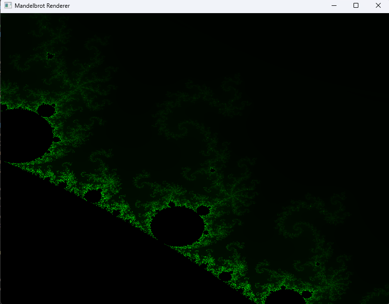
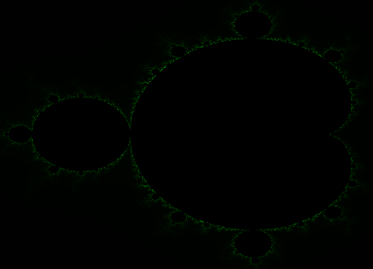

# Mandelbrot Fractal Renderer (OpenGL)

A real-time Mandelbrot fractal renderer using OpenGL and C++, featuring GPU-accelerated computation and smooth green gradient coloring. This project demonstrates fragment shader programming, complex number iteration, and interactive zooming. Use W and S keys to zoom in and out and also arrow keys to move around the render!

##  Zoomed-In View



##  Full Render



## Features

- Real-time rendering using OpenGL 3.3 Core Profile
- Smooth coloring based on continuous iteration counts
- Visually appealing green gradient shader
- Zoom and pan for Mandelbrot exploration
- Lightweight, fast, and GPU-accelerated

## Build & Run

### Prerequisites

- C++ Compiler with C++11 support or later
- [GLFW](https://www.glfw.org/) (Window/context/input management)
- [GLAD](https://glad.dav1d.de/) (OpenGL function loader)
- OpenGL 3.3 capable GPU

### Building (Linux/macOS)

```bash
git clone https://github.com/your-username/mandelbrot-opengl.git
cd mandelbrot-opengl
g++ main.cpp -o mandelbrot -lglfw -ldl -lGL
./mandelbrot
